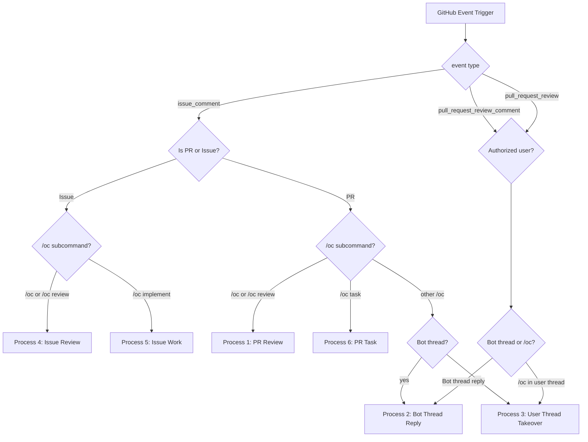

# OpenCode Workflow Flows

This repository contains GitHub Actions workflows that implement a
six-process automation pipeline for **issues** (review → work) and
**pull requests** (review → discuss → task).

## State Machine

## Process 1 — PR Review (On-Demand Code Review Gate)

**Trigger:** Any comment starting with `/oc` on a PR (issue_comment event),
except `/oc task` and `/oc implement` which are routed to other processes.

**Constraints:**
- PR is not a draft
- Comment starts with `/oc` (excluding `/oc task` and `/oc implement`)
- User is OWNER, MEMBER, or COLLABORATOR

**Actions:** Scans the git diff and posts a formal code review with
inline comments and suggestions on specific lines of code.

**Workflow:** `.github/workflows/opencode-pr-review.yml`

---

## Process 2 — PR Discussion (Opencode-Owned Threads)

**Trigger:** Reply in a review thread originally opened by the bot
(`opencode-agent[bot]`). No `/oc` keyword required.

**Constraints:**
- The parent comment in the thread was authored by the bot
- User is OWNER, MEMBER, or COLLABORATOR

**Actions:** Feeds the full thread history into the model. Opencode
replies in the thread or pushes a commit if the user requests a fix.

**Workflow:** `.github/workflows/opencode-pr-comment.yml`

---

## Process 3 — PR Discussion (User-Owned Thread Takeover)

**Trigger:** `/oc` in a `pull_request_review_comment` thread NOT
originally created by the bot.

**Constraints:**
- Thread was created by a human
- Comment contains `/oc`
- User is OWNER, MEMBER, or COLLABORATOR

**Actions:** Extracts thread history, assumes responsibility, drafts
a response, and applies code changes if explicitly requested. From
that point on, further interactions follow Process 2 logic.

**Workflow:** `.github/workflows/opencode-pr-comment.yml`

---

## Process 4 — Issue Review (No-Code Refining Phase)

**Trigger:** `/oc` or `/oc review` on an issue (not a PR).

**Constraints:**
- Not a pull request
- Comment starts with `/oc` (but not `/oc implement`)
- User is OWNER, MEMBER, or COLLABORATOR

**Actions:** Fetches issue details and conversation timeline. The AI
refines instructions, identifies technical roadblocks, or fills
requirement gaps. Output is restricted to plain discussion or
formatted markdown comments (strictly zero code changes).

**Workflow:** `.github/workflows/opencode-issue-handler.yml`

---

## Process 5 — Issue Work (Task Orchestration & Scoping)

**Trigger:** `/oc implement <information>` on an issue.

**Constraints:**
- Not a pull request
- Comment matches `/oc implement <info>`
- User is OWNER, MEMBER, or COLLABORATOR

**Optional flags** (append after `<information>` on the same line):
- `--model=<id>` — override the AI model (default: `opencode/north-mini-code-free`)
- `--draft` — create the PR as a GitHub draft
- `--no-changelog` — skip the CHANGELOG.md append step

Example: `/oc implement add retry logic for AI failures --model=opencode/deepseek-v4-flash-free --draft`

**Actions:**
1. Parses flags from the command; strips them from the task description
2. Computes a branch slug via `pr-tasks.sh slug` (deterministic, not AI-generated)
3. Implements the feature, commits, pushes
4. Appends a CHANGELOG.md entry via `pr-tasks.sh changelog` (unless `--no-changelog`)
5. Creates a Pull Request (draft if `--draft`) with task checklist (`- [ ] task`)

**Workflow:** `.github/workflows/opencode-issue-handler.yml`

---

## Process 6 — PR Task (Targeted Coding Execution)

**Trigger:** `/oc task` or `/oc task <task>` on a PR.

**Constraints:**
- Is a pull request
- Comment matches `/oc task` or `/oc task <task>`
- User is OWNER, MEMBER, or COLLABORATOR

**Optional flags** (append after `<task>`):
- `--model=<id>` — override the AI model (default: `opencode/north-mini-code-free`)

**Actions:**
- If `<task>` argument present: looks up that description in the PR body
- If empty: parses the PR body, extracts the first uncompleted `- [ ]` task
- Executes localized refactoring, pushes code
- Flips the checkbox `- [x]` via `pr-tasks.sh check-task` (scripted, not AI-generated)

**Workflow:** `.github/workflows/opencode-pr-comment.yml`

---

## Files Involved

| Workflow | File | Processes |
|----------|------|-----------|
| **PR Review** | `.github/workflows/opencode-pr-review.yml` | Process 1 |
| **PR Comment** | `.github/workflows/opencode-pr-comment.yml` | Processes 2, 3, 6 |
| **Issue Handler** | `.github/workflows/opencode-issue-handler.yml` | Processes 4, 5 |
| **Auth Script** | `.github/scripts/auth.sh` | Shared command parser + flags |
| **PR Tasks Script** | `.github/scripts/pr-tasks.sh` | Deterministic slug/checklist/changelog |
| **Run Action** | `.github/actions/opencode-run/action.yml` | Lifecycle: ack / react / status |

## Shared Infrastructure

### Authorization Script (`.github/scripts/auth.sh`)

A reusable bash script that parses `/oc` command prefixes from
comment bodies and determines the sub-command and optional flags:

| Input | `SUBCOMMAND` Output |
|-------|---------------------|
| `/oc` or `/oc review` | `discuss` / `review` |
| `/oc implement <info>` | `implement` |
| `/oc task <task>` | `task` |
| `/oc task` | `task` |
| Non-`/oc` comment | `none` |

**Recognized flags** (stripped from `TASK_ARGS`):
- `--model=<id>` → `FLAG_MODEL`
- `--draft` → `FLAG_DRAFT=true`
- `--no-changelog` → `FLAG_NO_CHANGELOG=true`

### PR Tasks Script (`.github/scripts/pr-tasks.sh`)

Deterministic git-plumbing helpers that replace model-delegated work:

| Subcommand | Purpose |
|------------|---------|
| `slug <title>` | Sanitize a title into a ≤40-char branch slug |
| `check-task <pr#> [needle]` | Flip first `- [ ]` → `- [x]` matching needle |
| `changelog <issue#> <message>` | Append `[Unreleased] / Added` entry to CHANGELOG.md |

### Composite Action (`.github/actions/opencode-run`)

The shared lifecycle action called by all AI-invoking jobs:

| Stage | Input | Effect |
|-------|-------|--------|
| Ack | `do-ack: true` | Post 👀 on trigger comment + create sticky status comment |
| Success | `do-success: true` | Post 🎉 + update status comment to ✅ Done |
| Failure | `do-failure: true` | Post 👎 + update status comment to ❌ Failed with run link |

The status comment uses a hidden HTML marker to find and edit itself
instead of posting multiple comments.

### Bot Exclusion

All workflows exclude comments from:
- `github-actions[bot]`
- `opencode-agent[bot]`
- `coderabbitai[bot]`
- `opencode-maintenance[bot]`

### Authorization Check

All workflows verify the commenter has `OWNER`, `MEMBER`, or
`COLLABORATOR` association via the built-in
`github.event.comment.author_association` field.

### Concurrency Control

Each workflow uses a concurrency group keyed by the issue/PR number
with `cancel-in-progress: false` to prevent overlapping runs.

## Token Strategy

- All OpenCode process steps use `use_github_token: true` (the built-in
  `GITHUB_TOKEN`) for `gh` CLI operations, commits, and pushes.
- The `GITHUB_TOKEN` is sufficient for all current operations: posting
  reviews, comments, pushing branches, and creating PRs.

## Optimizations

### Draft PR Skip

Process 1 checks `gh pr view --json isDraft` and skips reviews on
draft pull requests.

### Command Parsing Pre-Step

All workflows run `.github/scripts/auth.sh` as an early step to
determine the exact sub-command and flags before invoking the AI,
enabling clean routing without wasting AI tokens on misrouted events.

### Thread Ownership Detection

Process 2 checks thread authorship before running AI to avoid
triggering the model on non-bot threads (which would be Process 3).

### Deterministic Scripting

Process 5 computes the branch slug via `pr-tasks.sh slug` before
calling the AI, so the model receives a pre-computed `$BRANCH` and
does not spend tokens on text transforms. The CHANGELOG entry and
checklist flip are also scripted post-AI steps.

### Acknowledgement Feedback

All AI jobs post a 👀 reaction and a sticky "running" status comment
at the start of the job, so users get immediate feedback without
waiting for the AI to finish. The status comment is edited to
✅/❌ on completion.

### Retry on Failure

Every AI job retries once after a 30-second pause on transient
failure (rate limits, timeouts, 5xx). The second attempt uses the
same model and prompt.

### Timeouts

All AI jobs have explicit `timeout-minutes` (15 for
review/discussion, 30 for implementation) to bound AI freeze scenarios
— previously only Process 4/5 had this protection.
