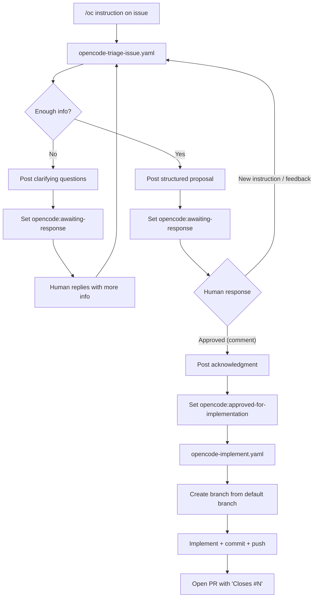
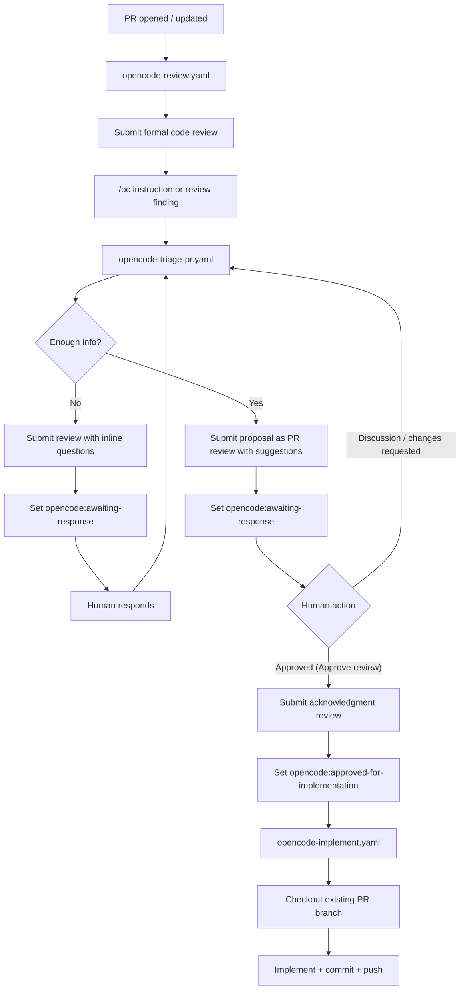

# OpenCode Workflow Flows

This repository contains four GitHub Actions workflows that implement two
end-to-end automation pipelines: one for **issues** (triage → implement) and one
for **pull requests** (review → triage → implement).

## Issue Flow

Triggered when a collaborator posts `/oc` (or `/opencode`) on an issue. The
workflow triages the request, iterates with the reporter, and — once approved —
creates a new pull request with the implementation.

### Workflow state labels

| Label | Meaning | Set by |
|-------|---------|--------|
| `opencode:awaiting-response` | Waiting for human input | triage-issue |
| `opencode:approved-for-implementation` | Ready to implement | triage-issue |

### Files involved

| Workflow | File | Trigger |
|----------|------|---------|
| **Triage (issue)** | `.github/workflows/opencode-triage-issue.yaml` | `issue_comment` containing `/oc` or label `opencode:awaiting-response` present |
| **Implement** | `.github/workflows/opencode-implement.yaml` | `issues: [labeled]` with `opencode:approved-for-implementation` |

---

## PR Flow

Triggered when a PR is opened or updated. The code review workflow reviews the
diff. If the author responds with `/oc` (or a review finding needs discussion),
the triage workflow analyses the PR and submits a proposal as a formal PR review
with inline suggestions. Once accepted, the implementation workflow pushes
commits directly to the existing PR branch.

### Workflow state labels

| Label | Meaning | Set by |
|-------|---------|--------|
| `opencode:awaiting-response` | Waiting for human input | triage-pr |
| `opencode:approved-for-implementation` | Ready to implement | triage-pr |

### Files involved

| Workflow | File | Trigger |
|----------|------|---------|
| **Review** | `.github/workflows/opencode-review.yaml` | `pull_request: [opened, synchronize, reopened, ready_for_review]` |
| **Triage (PR)** | `.github/workflows/opencode-triage-pr.yaml` | `pull_request_review_comment` or `pull_request_review` containing `/oc` or label `opencode:awaiting-response` present |
| **Implement** | `.github/workflows/opencode-implement.yaml` | `pull_request: [labeled]` with `opencode:approved-for-implementation` |

---

## Implement workflow behaviour

The `opencode-implement.yaml` workflow handles both trigger sources by
inspecting which event payload is present:

| Trigger | Action |
|---------|--------|
| **Issue** (`github.event.issue` present) | Creates a new feature branch from the default branch, implements, commits, pushes, and opens a PR referencing the issue with `Closes #N` |
| **Pull request** (`github.event.pull_request` present) | Checkouts the existing PR branch via `gh pr checkout`, implements, commits, and pushes to that same branch |

## Token strategy

- **triage-issue** and **triage-pr** use the OpenCode GitHub App token (via OIDC
  exchange, `use_github_token: false`) so that label changes trigger downstream
  workflow events.
- **review** and **implement** use the built-in `GITHUB_TOKEN`
  (`use_github_token: true`) since they do not need to chain further workflow
  events.
