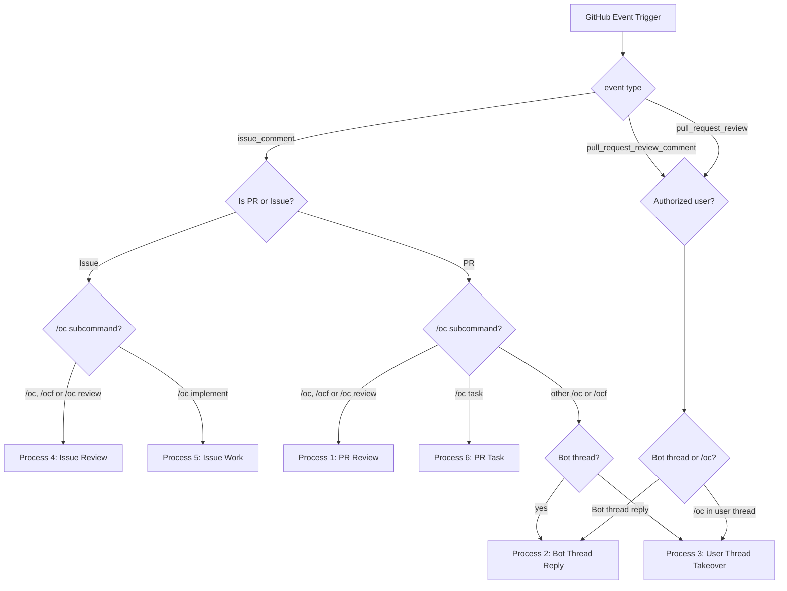

# OpenCode Workflow Flows

This repository contains GitHub Actions workflows that implement a
six-process automation pipeline for **issues** (review → work) and
**pull requests** (review → discuss → task).

## State Machine

```mermaid
flowchart TD
    A["GitHub Event Trigger"] --> B{"event type"}
    B -- "issue_comment" --> C{"Is PR or Issue?"}
    B -- "pull_request_review_comment" --> D{"Authorized user?"}
    B -- "pull_request_review" --> D

    C -- "Issue" --> E{"/oc subcommand?"}
    E -- "/oc, /ocf or /oc review" --> F["Process 4: Issue Review"]
    E -- "/oc implement <info>" --> G["Process 5: Issue Work"]

    C -- "PR" --> H{"/oc subcommand?"}
    H -- "/oc, /ocf or /oc review" --> I["Process 1: PR Review"]
    H -- "/oc task <task>" --> J["Process 6: PR Task"]
    H -- "other /oc or /ocf" --> K{"Bot thread?"}
    K -- "yes" --> L["Process 2: Bot Thread Reply"]
    K -- "no" --> M["Process 3: User Thread Takeover"]

    D --> N{"Bot thread or /oc?"}
    N -- "Bot thread reply" --> L
    N -- "/oc in user thread" --> M
```

## Process 1 — PR Review (On-Demand Code Review Gate)

**Trigger:** Any comment starting with `/oc` or `/ocf` on a PR
(issue_comment event), except `/oc task`/`/ocf task` and
`/oc implement`/`/ocf implement` which are routed to other processes.
`/oc` runs the Go (paid) model, `/ocf` runs the free model.

**Constraints:**
- PR is not a draft
- Comment starts with `/oc` (excluding `/oc task` and `/oc implement`)
- User is OWNER, MEMBER, or COLLABORATOR

**Actions:** Scans the git diff and posts a formal code review with
inline comments and suggestions on specific lines of code.

**Workflow:** `.github/workflows/opencode-pr-review.yml`

---

## Process 2 — PR Discussion (Opencode-Owned Threads)

**Trigger:** Reply in a review thread originally opened by the bot
(`opencode-agent[bot]`). No `/oc` keyword required.

**Constraints:**
- The parent comment in the thread was authored by the bot
- User is OWNER, MEMBER, or COLLABORATOR

**Actions:** Feeds the full thread history into the model. Opencode
replies in the thread or pushes a commit if the user requests a fix.

**Workflow:** `.github/workflows/opencode-pr-comment.yml`

---

## Process 3 — PR Discussion (User-Owned Thread Takeover)

**Trigger:** `/oc` or `/ocf` in a `pull_request_review_comment` thread NOT
originally created by the bot.

**Constraints:**
- Thread was created by a human
- Comment contains `/oc` or `/ocf`
- User is OWNER, MEMBER, or COLLABORATOR

**Actions:** Extracts thread history, assumes responsibility, drafts
a response, and applies code changes if explicitly requested. From
that point on, further interactions follow Process 2 logic.

**Workflow:** `.github/workflows/opencode-pr-comment.yml`

---

## Process 4 — Issue Review (No-Code Refining Phase)

**Trigger:** `/oc`, `/ocf` or `/oc review` on an issue (not a PR).
`/oc` runs the Go (paid) model, `/ocf` runs the free model.

**Constraints:**
- Not a pull request
- Comment starts with `/oc` (but not `/oc implement`)
- User is OWNER, MEMBER, or COLLABORATOR

**Actions:** Fetches issue details and conversation timeline. The AI
refines instructions, identifies technical roadblocks, or fills
requirement gaps. Output is restricted to plain discussion or
formatted markdown comments (strictly zero code changes).

**Workflow:** `.github/workflows/opencode-issue-handler.yml`

---

## Process 5 — Issue Work (Task Orchestration & Scoping)

**Trigger:** `/oc implement <information>` or `/ocf implement <information>`
on an issue. `/oc` runs the Go (paid) model, `/ocf` runs the free model.

**Constraints:**
- Not a pull request
- Comment matches `/oc implement <info>`
- User is OWNER, MEMBER, or COLLABORATOR

**Actions:**
1. Extracts the `<information>` string + issue body
2. Sanitizes the title to generate a unique feature branch
3. Implements the feature, commits, pushes
4. Fetches remote tags (`git fetch --tags --force`) to detect release
   boundaries, then appends a CHANGELOG.md entry: new changes under
   `[Unreleased]`, changes belonging to an already-released version in
   that release's paragraph
5. Creates a Pull Request with task checklist (`- [ ] task`)

**Workflow:** `.github/workflows/opencode-issue-handler.yml`

---

## Process 6 — PR Task (Targeted Coding Execution)

**Trigger:** `/oc task`, `/ocf task`, `/oc task <task>` or `/ocf task <task>`
on a PR. `/oc` runs the Go (paid) model, `/ocf` runs the free model.

**Constraints:**
- Is a pull request
- Comment matches `/oc task` or `/oc task <task>`
- User is OWNER, MEMBER, or COLLABORATOR

**Actions:**
- If `<task>` argument present: looks up that description in the PR
  description
- If empty: parses the PR body, extracts the first uncompleted
  `- [ ]` task, and uses it as the execution objective
- Executes localized refactoring, pushes code, flips the checkbox
  to `- [x]` in the PR summary

**Workflow:** `.github/workflows/opencode-pr-comment.yml`

---

## Files Involved

| Workflow | File | Processes |
|----------|------|-----------|
| **PR Review** | `.github/workflows/opencode-pr-review.yml` | Process 1 |
| **PR Comment** | `.github/workflows/opencode-pr-comment.yml` | Processes 2, 3, 6 |
| **Issue Handler** | `.github/workflows/opencode-issue-handler.yml` | Processes 4, 5 |
| **Auth Script** | `.github/scripts/auth.sh` | Shared command parser |

## Shared Infrastructure

### Authorization Script (`.github/scripts/auth.sh`)

A reusable bash script that parses `/oc` (Go/paid model) and `/ocf`
(free model) command prefixes from comment bodies and determines the
model tier and sub-command:

| Input | `TIER` | `SUBCOMMAND` Output |
|-------|--------|---------------------|
| `/oc` or `/oc review` | `go` | `discuss` / `review` |
| `/ocf` or `/ocf review` | `free` | `discuss` / `review` |
| `/oc implement <info>` | `go` | `implement` |
| `/ocf implement <info>` | `free` | `implement` |
| `/oc task <task>` | `go` | `task` |
| `/ocf task <task>` | `free` | `task` |
| `/oc task` / `/ocf task` | `go` / `free` | `task` |
| Non-`/oc` comment | `go` | `none` |

### Bot Exclusion

All workflows exclude comments from:
- `github-actions[bot]`
- `opencode-agent[bot]`
- `coderabbitai[bot]`
- `opencode-maintenance[bot]`

### Authorization Check

All workflows verify the commenter has `OWNER`, `MEMBER`, or
`COLLABORATOR` association via the built-in
`github.event.comment.author_association` field.

### Concurrency Control

Each workflow uses a concurrency group keyed by the issue/PR number
with `cancel-in-progress: false` to prevent overlapping runs.

## Token Strategy

- All OpenCode process steps use `use_github_token: true` (the built-in
  `GITHUB_TOKEN`) for `gh` CLI operations, commits, and pushes.
- The `GITHUB_TOKEN` is sufficient for all current operations: posting
  reviews, comments, pushing branches, and creating PRs.

## Optimizations

### Draft PR Skip

Process 1 checks `gh pr view --json isDraft` and skips reviews on
draft pull requests.

### Command Parsing Pre-Step

All workflows run `.github/scripts/auth.sh` as an early step to
determine the exact sub-command before invoking the AI, enabling
clean routing without wasting AI tokens on misrouted events.

### Thread Ownership Detection

Process 2 checks thread authorship before running AI to avoid
triggering the model on non-bot threads (which would be Process 3).
